# Welcome to My Mastermind in Java
## Overview
This project implementats the classic Mastermind number guessing game. The user plays against the program. Read more about it here: 
* https://en.wikipedia.org/wiki/Mastermind_(board_game)

Key features include:
- Written in Java, adhering to Object-Oriented Programming (OOP) and (mostly) SOLID principles.
- Game data, including player names, rounds, results, timestamps, secret codes, and guess histories, are stored in an SQLite database.
- Docker-enabled for cross-platform compatibility and ease of use.
- Player can select number of players, levels, and display a leaderboard

## Game Rules
The goal of Mastermind is to guess the secret code composed of four distinct pieces, each ranging from 0 to 7. After each guess, feedback is provided:

- Correctly placed pieces: Numbers in the correct position.
- Misplaced pieces: Numbers that are correct but in the wrong position.
  
The user has 10 attempts by default (configurable) to guess the secret code.


## Installation and Operation
The game can be played through a command line interface (locally), or through a Docker container (requires Docker Desktop). The addition of Docker should allow a user to run my application on any system that supports Docker.


#### Requirements
Java: To check if you have it installed, in the terminal:</br>
If not installed, you can install here: https://www.java.com/en/

```
java -version
```

Docker Desktop: This application manages containerization. To check if Docker is installed, in the terminal:
```
docker --version
```
If not installed, you can download it here: https://www.docker.com/get-started/

#### Installation:
Copy the repository:
```
git clone https://github.com/aip956/MM_Reach.git
```

Change into the cloned repository
```
cd MM_Reach
```
</br>

### Running the Game
#### Local Execution

Enable the script (1st time): </br>
```
chmod +x ./play_LocalMM.sh
```

Run: </br>
```
./play_LocalMM.sh
```


Optional: Display the leaderboard (default: top 3 players; example shows 5)
```
./play_LocalMM.sh --leaderboard 5
```

View data:
Navigate to database directory
```
cd src/data
```

Open the SQL shell
```
sqlite3 MM_Reach.db
```

Optional: Turn on headers
```
.header on
SELECT * FROM game_data;
```
Exit the sql shell
```
.exit
```


#### Docker Execution
1. Start the Desktop Docker
2. In the game directory's command line , enable script access(1st time):
```
chmod +x ./play_DockerMM.sh
```

3. Build and run the container:
```
./play_DockerMM.sh
``` 
View Data in Docker:
1. Start game again, but don't play. Open another terminal and enter the bash shell:
```
docker exec -it game /bin/bash
```    
Change directory to the data dir and open the SQLite shell.Turn header view on, and view the data:
```
cd src/data
sqlite3 MM_Reach.db
.header on
SELECT * FROM game_data;

```
Exit the SQLite shell:
```
.exit
```

Exit the container's shell:
```
.exit
```

</br>
</br>

## Screen Captures

### For the sake of brevity, I limited the maximum attempts to 5 (instead of 10).</br>

#### Run and play the game locally using the command line:</br> 
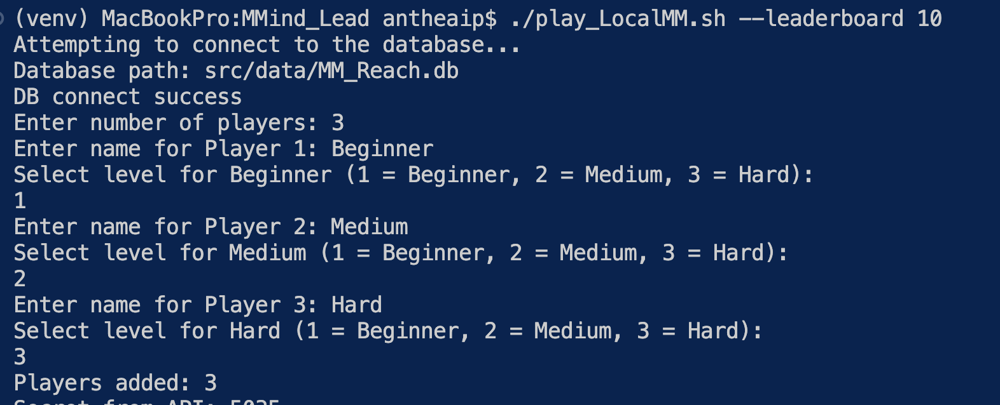

</br>

#### Wrong input entered!</br> 
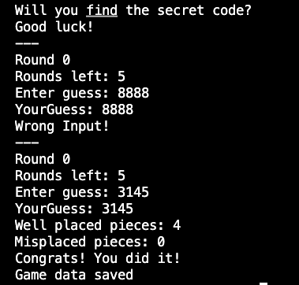 
</br>

#### Feedback (different per level)</br>
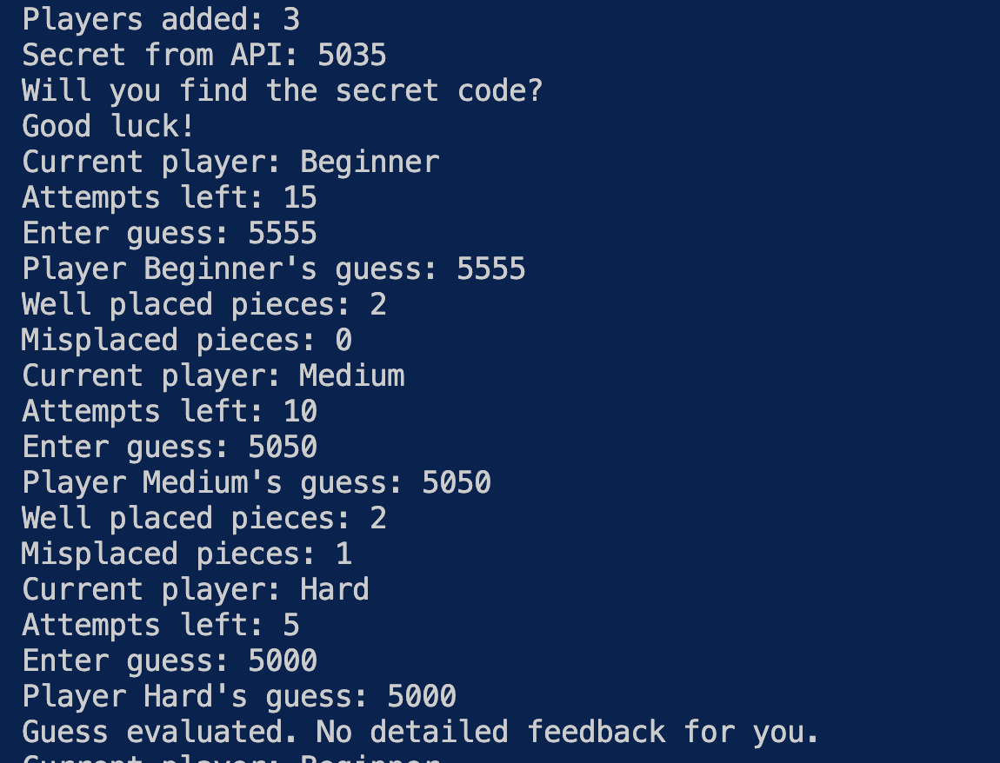 
</br>

#### Leaderboard output</br>
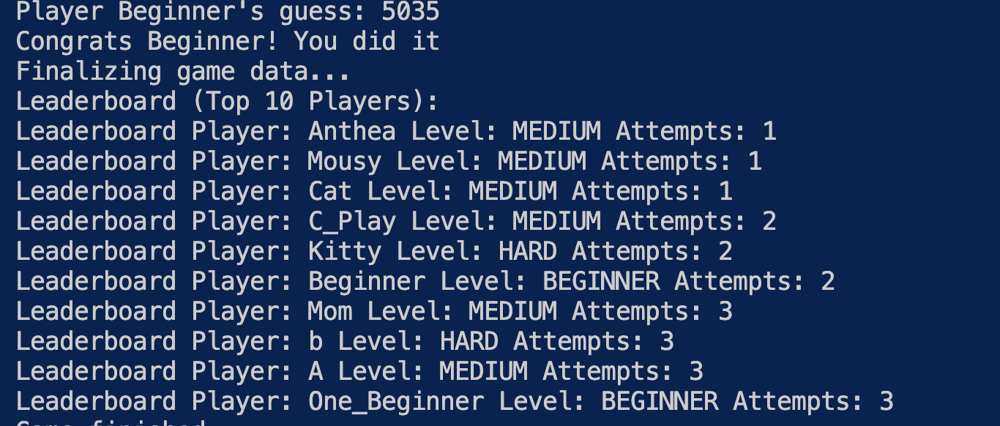 
</br>

#### Viewing data in DB Browser:</br> 
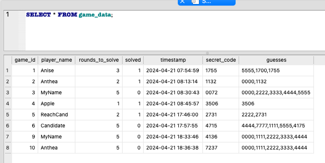
</br>

#### Viewing data in the terminal</br> 
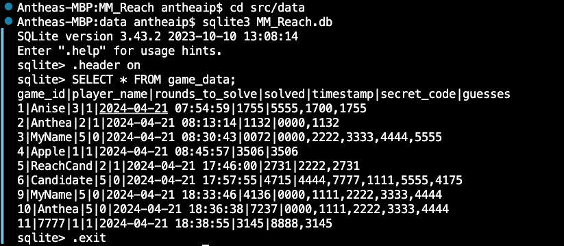
</br>
</br>

### Running in Docker:
#### Build and Run Container:</br>

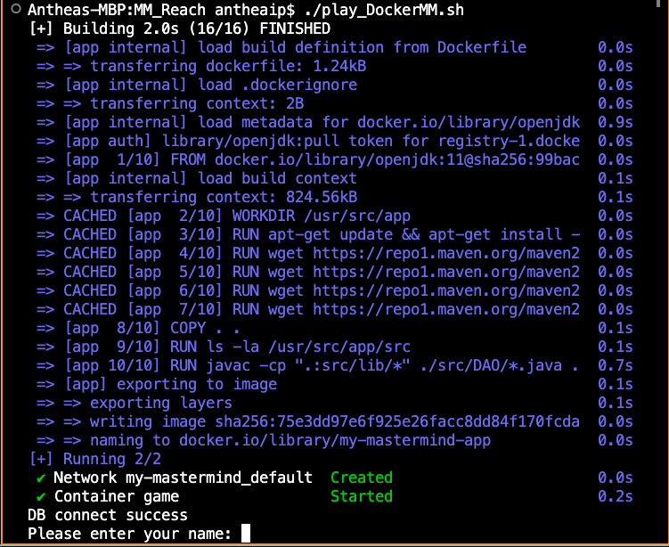
</br>

#### Playing in Docker:
##### After building the container, game play is the same as running locally 
</br>

#### View Docker Data:</br> 
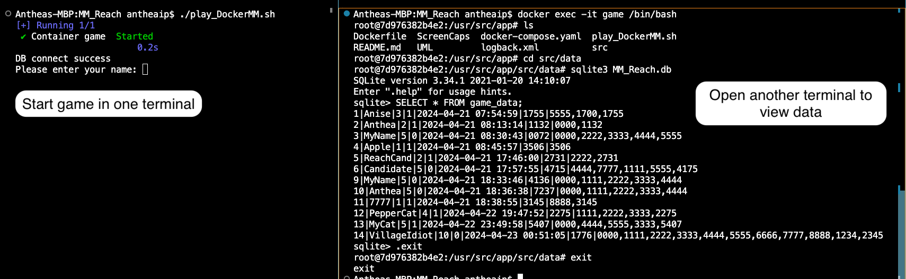
</br>

#### Docker Desktop, Container:</br> 
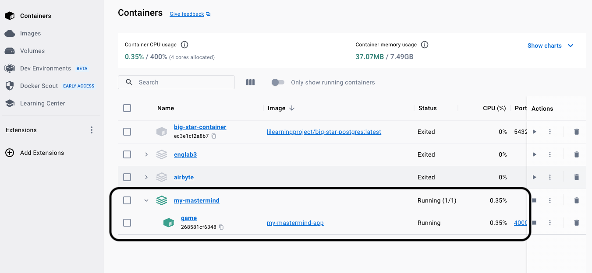
</br>

#### Docker Desktop, Image:</br> 
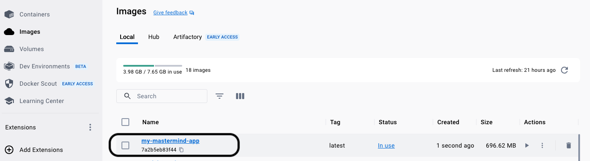
</br>

</br>

## Design

I created this in Java, aspiring to use Object Oriented Programming. Creating the class structure is challenging for me, and I thought about the nouns I was modelling. 


#### Unified Modeling Language Diagram
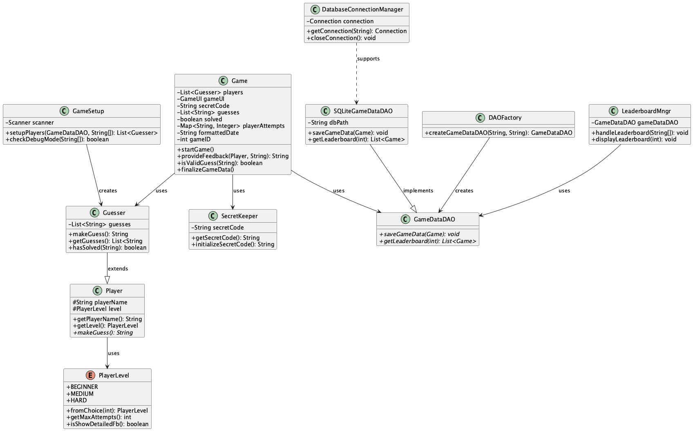

#### Models Package
Game: This class manages the game flow, including starting the game, managing the rounds, and finalizing the game data. 
* Single Responsibility: Coordinates game logic
* Dependency Inversion Principle: Relies on abstractions by interacting with the Guesser, SecretKeeper, GameData, and GameDataDAO interfaces rather than concrete implementations

Player: The Player is an abstract class for players. SecretKeeper and Guesser will extend from Player.  
* Open/Closed Principle: It's easily extendable to add more player types without modifying existing code.
* Abstraction: It abstracts player details, providing a base for specific player types.

SecretKeeper: The SecretKeeper generates and maintains the secret code, evaluates guesses, and provides feedback. It extends from Player. 
* Single Responsibility Principle: Focused on maintaining and validating the secret code.
* Dependency Inversion Principle: It uses Player as a base class, promoting use of abstractions over concrete classes.

Guesser: The Guesser represents the player making guesses against the secret code. It extends from Player; it inputs the guess.
* Open/Closed Principle: New guessing strategies can be added without modifying existing code by extending this class.
* Liskov Substitution Principle: As a subclass of Player, it can be used anywhere a Player is expected without affecting the behavior negatively.

GameData: The GameData stores the relevant data about a game session, such as player name, guesses, and outcome.
* Single Responsibility Principle: It's solely responsible for holding and transferring game data.
* Encapsulation: It keeps data safe from unauthorized access, exposing only necessary parts through methods


#### View Package
GameUI: The GameUI handles all user interactions, including displaying messages and capturing user input.
* Single Responsibility Principle: It's dedicated solely to user interface operations.

#### DAO Package
GameDataDAO: This class is an interface for data access operations related to GameData, such as saving and retrieving game data. (Other game retrieval methods would be defined here, like getGamesByPlayer)
* Interface Segregation Principle: Clients will not be forced to depend on methods they do not use.

SQLiteGameDataDAO: This class implements GameDataDAO, providing specific data operations using SQLite. (Other games retrieval methods would be implemented here.)
* Dependency Inversion Principle: It depends on the GameDataDAO abstraction, allowing for flexibility in data storage methods
* Single Responsibility Principle: It manages the database operations specific to GameData

#### DBConnectionManagerPackage
DatabaseConnectionManager: This class manages database connections, ensuring a single active connection or creating a new one as needed
* Single Responsiblity Principle: It centralizes the management of database connections, separating it from other database operations
* Singleton Pattern: It ensures that there is a single instance of the connection, reused throughout the application

#### SOLID Design Principles:
While my game design aims to be SOLID, I also needed to balance simplicity and scope. For example, 

Single Responsibility Principle
* A class should have only one job/responsibility
* However, some of my classes take on additional responsibilities to avoid excessive fragmentation and over-complication.
* Game handles the game loop, processing guesses, interfacing with GameUI; it mixes game logic with user interaction. 

Open-Closed Principle
* Entities (classes, functions, etc.) should be open for extension but closed for modification
* However, some of my classes also are not closed to modification; this is also for simplicity.
* Adding new players might change how the Game class operates.

Liskov Sustitution Principle
* Objects of a superclass should be replaceable with objects of subclasses
* However, subclasses of Player (e.g. AIPlayer) might not be used interchangeably without the Game class knowing the differences.

Interface Segregation Principle
* Clients should not be forced to depend on interfaces they don't use
* However, some interfaces implementations do not use all methods

Dependency Inversion Principle
* High-level modules should not depend on low-level modules; both should depend on abstractions
* However, a high-level module (Game) might depend on low-level ones (e.g. Guesser, SQLiteGameDataDAO) rather than abstractions

#### OOP Principles:
Abstraction
* Hide implementation details

Inheritance
* Allows one object to acquire the properties and methods of another

Polymorphism
* Allows an inherited object to have different method implementations

Encapsulation
* Each object should control its own state

#### Other:
Java:
* I've been learning Java and felt it a good language for this project. It's a mature language, with vast ecosystem (development tools, libraries, community, etc.). I also chose an OOP design as the modularity allows greater complexity management and code reusability.

Docker:
* I've added Dockerfile to allow a user to run my application on any system that supports Docker.
  * Dockerfile: Defines the environment, dependencies, and necessary commands
  * Although the game runs in a single container, I have a docker-compose.yaml which simplifies and centralizes the configurations, making it easier to scale the application (even within one container). It also allows starting, stopping and rebuilding with simple commands (e.g. docker-compse up, docker-compse down).

Database
* I chose SQLite for the database. I assumed the data volume would be low, and the data is fairly structured.

Logging
* Included in the game code is Logback. While I was coding it was helpful for debugging. I've kept it in the code so that if the code is extended, logging can continue to help debug.

I've also added a .gitignore file to prevent certain files from being committed to the git repository. This will help keep the repository clean and focused.

## Future improvements
* Research other databases: I could use Mockito to generate data and test more robust databases (e.g. Postgres, MySQL, etc.)
* Add an AI Player: I'd create a new AIPlayer class that extends Player. The core of the AIPlayer will be a method that generates the guesses. I'd then modify the Game class
* JUnit tesing: Write and execute automated tests for models, game logic, DAO implementations, integration.
* Implement getGamesBy____ (Player, solved, etc.). This could be used for showing player and solve rate statistics. 
* Add command line flag capability so that the player can indicate if they wish to display the secret at the beginning of the game for debugging purposes.


testing
